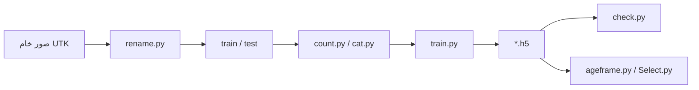

# AGEAI — تقدير العمر من الصور

مشروع تعلم آلي لتقدير عمر الشخص من صورة الوجه، باستخدام **VGG16** (نقل التعلم) وواجهة مباشرة عبر الكاميرا أو اختيار صورة من القرص.

---

## نظرة عامة

| المكوّن | الوصف |
|--------|--------|
| النموذج | VGG16 مجمّد + طبقات كثيفة للانحدار (تنبؤ بعمر واحد) |
| التدريب | صور في مجلدات `train` و `test` بأسماء تحمل العمر |
| الاستخدام المباشر | `ageframe.py` — كاميرا + كشف وجه + عرض العمر في واجهة Tkinter |
| التقييم | `check.py` — MAE / MSE / RMSE ورسم Actual vs Predicted |

---

## هيكل المشروع

```
AGEAI/
├── ageframe.py                          # التطبيق الرئيسي (كاميرا + واجهة)
├── train.py                             # تدريب النموذج وحفظه
├── check.py                             # تقييم النموذج ورسم الأداء
├── Select.py                            # تنبؤ بالعمر من صورة واحدة (مربع حوار)
├── count.py                             # عدّ الصور لكل فئة عمرية في train
├── cat.py                               # نقل الزائد عن 50 صورة لكل عمر إلى remove
├── rename.py                            # إعادة تسمية صور UTK من تنسيق nm_* إلى age_*
├── haarcascade_frontalface_default.xml  # كاشف الوجه (OpenCV)
├── age_estimation_model_VGG16.h5        # النموذج المستخدم في التطبيق والتقييم
├── age1_estimation_model_vgg16.h5       # نسخة إضافية من النموذج (احتياطي)
├── Figure_1.png                         # مثال على رسم أداء النموذج
├── train/                               # بيانات التدريب (غير مضمّنة في المستودع)
├── test/                                # بيانات الاختبار
└── T/                                   # مجلد اختبار لـ check.py
```

> **ملاحظة:** مجلدات `train`، `test`، `T`، `imge`، `newimage`، `remove` تُنشأ أثناء إعداد البيانات وليست دائماً موجودة في نسخة المشروع.

---

## تسمية ملفات الصور

يُستخرج **العمر** من الجزء الأول قبل `_` في اسم الملف:

```
{العمر}_0_1_اسم_أصلي.jpg
```

مثال: `25_0_1_nm00001_0000_01.jpg` → العمر **25**.

سكربت `rename.py` يحوّل صور UTK (تبدأ بـ `nm`) باستخدام سنة الميلاد في اسم الملف وسنة مرجعية (افتراضي **2015**):

```python
age = reference_year - birth_year
new_file_name = f"{age}_0_1_{file_name}"
```

---

## المتطلبات

- Python 3.8+
- كاميرا ويب (لتشغيل `ageframe.py`)

### الحزم

```bash
pip install tensorflow opencv-python pillow numpy matplotlib scikit-learn
```

| الحزمة | الاستخدام |
|--------|-----------|
| `tensorflow` / `keras` | التدريب، التحميل، التنبؤ |
| `opencv-python` | الكاميرا وكشف الوجه |
| `Pillow` | عرض الصور في Tkinter |
| `matplotlib` | رسوم التقييم في `check.py` |
| `scikit-learn` | MAE و MSE في `check.py` |

---

## التشغيل السريع

### 1. تطبيق الكاميرا (الواجهة الرئيسية)

```bash
python ageframe.py
```

- يفتح نافذة **400×500** مع بث الكاميرا (300×200).
- عند **ظهور وجه جديد** يُنفَّذ التنبؤ مرة واحدة (Haar cascade).
- عند اختفاء الوجه يُعرض **N/A** في الدائرة الخضراء.
- التحديث كل **500 ms**.

تأكد من وجود `age_estimation_model_VGG16.h5` و `haarcascade_frontalface_default.xml` في نفس مجلد `ageframe.py`.

### 2. تنبؤ من صورة واحدة

```bash
python Select.py
```

يُفتح مربع حوار لاختيار `.jpg` أو `.png` ويطبع العمر المتوقع في الطرفية.

### 3. تدريب نموذج جديد

1. ضع الصور في `train/` و `test/` بالتسمية أعلاه.
2. شغّل:

```bash
python train.py
```

- مرحلتان: تدريب مع VGG16 مجمّد، ثم فك تجميد آخر 4 طبقات بمعدل تعلم أقل.
- يحفظ النموذج باسم: `age_estimation_model_vgg16.h5` (حرف **v** صغير في vgg16).

إذا أردت استخدامه مع `ageframe.py` أو `check.py`، انسخه أو أعد تسميته إلى:

`age_estimation_model_VGG16.h5`

### 4. تقييم النموذج

```bash
python check.py
```

يحمّل `age_estimation_model_VGG16.h5` ويجرب على مجلد `T/` ثم يعرض scatter plot مع MAE و MSE و RMSE.

---

## سكربتات مساعدة للبيانات

| السكربت | الوظيفة |
|---------|---------|
| `count.py` | يطبع عدد الصور لكل عمر في `train/` |
| `cat.py` | إن تجاوز عمر واحد **50** صورة، ينقل الفائض إلى `remove/age_{عمر}/` |
| `rename.py` | نسخ وإعادة تسمية من `imge/` إلى `newimage/` (عدّل المسارات في الملف) |

---

## بنية النموذج (`train.py`)

1. **VGG16** (`imagenet`) بدون `top`، الطبقات الأساسية مجمّدة.
2. `MaxPooling2D` → `GlobalAveragePooling2D`.
3. `Dense(512)` + BatchNorm + Dropout(0.4).
4. `Dense(256)` + BatchNorm + Dropout(0.3).
5. `Dense(1, activation='relu')` — عمر غير سالب.
6. الخسارة: **MSE**، المقياس: **MAE**، المحسّن: **Adam**.

معالجة الإدخال: resize إلى **224×224**، قيم بيكسلات بين **0 و 1**.

---

## تدفق العمل المقترح



---

## ملاحظات تقنية

- **كشف الوجه:** `detectMultiScale` مع `scaleFactor=1.1` و `minNeighbors=5`؛ التنبؤ يُطلَق فقط عند انتقال من «لا وجه» إلى «وجود وجه».
- **حجم النموذج:** ملفات `.h5` كبيرة (~150–177 MB)؛ يُفضّل عدم رفعها إلى Git بدون Git LFS.
- **توافق الأسماء:** اختلاف حالة الأحرف بين `age_estimation_model_vgg16.h5` (بعد التدريب) و `age_estimation_model_VGG16.h5` (التطبيق) قد يسبب خطأ «ملف غير موجود» على أنظمة حساسة لحالة الأحرف.
- **Select.py** يحمّل النموذج من المسار الحالي دون `os.path.join`؛ شغّله من مجلد المشروع.

---

## استكشاف الأخطاء

| المشكلة | الحل المقترح |
|---------|----------------|
| `Error opening camera` | تحقق من الكاميرا، أغلق التطبيقات الأخرى، جرّب `VideoCapture(1)` |
| النموذج غير موجود | تأكد من اسم الملف `age_estimation_model_VGG16.h5` في مجلد المشروع |
| فشل `load_data` | تأكد من وجود `train/` أو `test/` وصور `.jpg`/`.png` بأسماء صحيحة |
| دقة ضعيفة | زِد بيانات التدريب، راجع توازن الأعمار بـ `count.py`، استخدم `cat.py` لحد 50/عمر |

---

## الترخيص والبيانات

إذا استخدمت مجموعة **UTKFace** أو مشابهة، التزم بترخيصها وشروط الاستخدام. ملف Haar cascade من مشروع OpenCV.

---

## المؤلف والمساهمة

مشروع تعليمي/تجريبي لتقدير العمر بالرؤية الحاسوبية. للمساهمة: وثّق تجاربك، وحسّن معالجة الوجه (مثلاً MTCNN) أو استبدال Tkinter بواجهة ويب حسب الحاجة.
